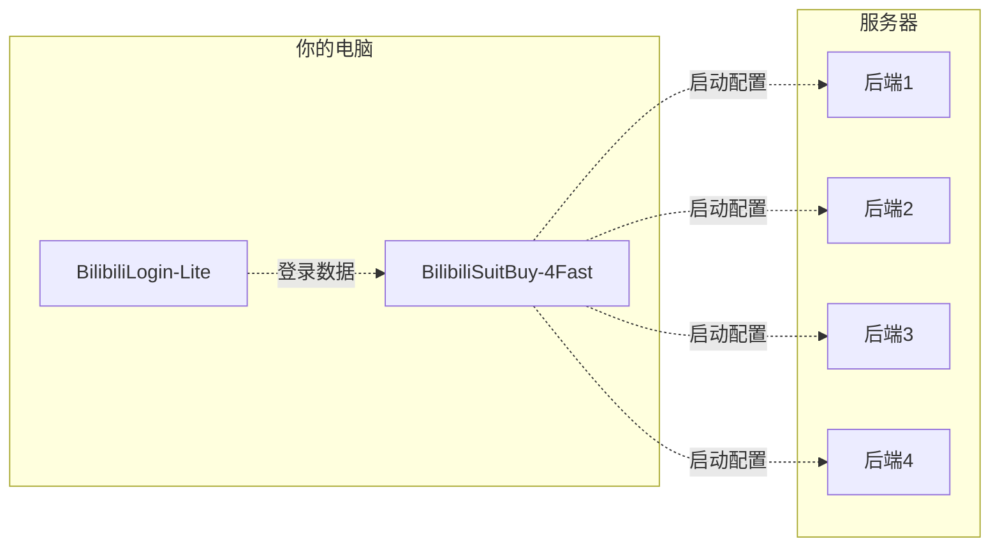

# bilisuit-go
B站装扮快速购买工具链后端（golang版本）  
在 https://github.com/lllk140/BilibiliSuitBuy 项目的基础上进行拆分以适应服务器平台运行环境。

## 使用环境
golang 1.19及以上

## 启动命令
```bash
go run main.go xxxxxx.json
```
其中`xxxxxx.json`使用 [BilibiliSuitBuy-4Fast](https://github.com/FangCunWuChang/BilibiliSuitBuy-4Fast) 工具生成

## 工具链
### 工作流程


### 相关工具
- 前端  
  [BilibiliLogin-Lite](https://github.com/FangCunWuChang/BilibiliLogin-Lite) B站账号登录工具  
  [BilibiliSuitBuy-4Fast](https://github.com/FangCunWuChang/BilibiliSuitBuy-4Fast) B站装扮购买配置生成工具  

- 后端  
  [bilisuit-go](https://github.com/FangCunWuChang/bilisuit-go) B站装扮购买后端Golang版本  
  [bilisuit-fast](https://github.com/FangCunWuChang/bilisuit-fast) B站装扮购买后端C版本
